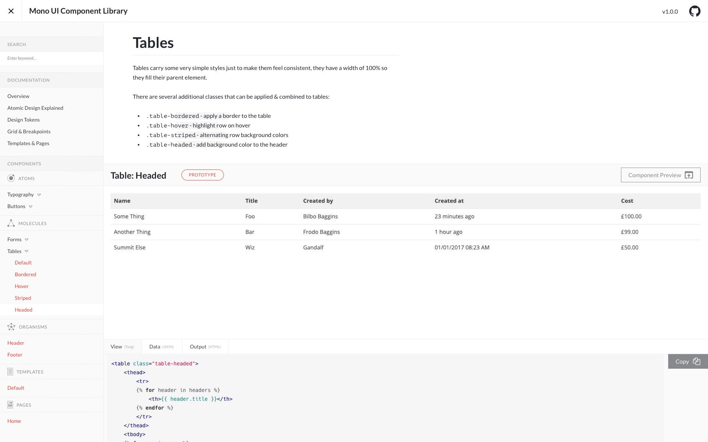

# Fractal Atomic

An awesome starter point for your Fractal UI component library.



## Features

* Use of [Twig](https://twig.symfony.com/) as the templating engine
* Component folder structure based on Atomic Design principles
* Folder structure that works with Fractal
* Markup, config and markdown files for typography, buttons, form elements and tables included
* Statuses for components & documentation pages improved
* Template export function included
* Uses [Mono](https://github.com/AccentDesign/Mono) theme 'out of the box'

## Installing

1. Click the 'Clone or download' button above
2.
3. Fill in PROJECT NAME, REPOSITORY URL and AUTHOR NAME in ```fractal.config.js```

## Configuration

In the [setup file](https://fractal.build/guide/project-settings.html#the-fractal-js-file) for your project you can ```require``` and use the subtheme:

```Shell
// fractal.config.js
'use strict';

const fractal = module.exports = require('@frctl/fractal').create();
const webUITheme = require('mono');

// ... project setup and configuration

fractal.web.theme(webUITheme); // use the sub-classed theme
```

**Note** - On Windows, a conflicting command-line application prevents you from running Fractal commands from the project's root directory (where your ```fractal.js``` config file will live). To work around this you can rename your config file ```fractal.config.js``` and then enter the following code to your ```package.json``` file:

```Shell
"fractal": {
    "main": "fractal.config.js"
}
```